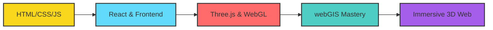

<!-- Creative Header with Animated Gradient -->
<div align="center">
  <a href="https://mqanass.github.io/">
    
  </a>
</div>

<br>

<!-- Animated Typing Effect -->
<div align="center">
  
</div>

<br>

<!-- Creative About Section with Glassmorphism Style -->
## 🎭 Welcome to My Digital Universe

<div align="center">
<table>
<tr>
<td width="50%">

### 👨‍💻 The Developer Behind the Magic

```javascript
const mo = {
  pronouns: "He/Him",
  location: "🌍 Earth",
  passion: "3D Web & GIS",
  mission: "Bridge reality & digital worlds",
  superpower: "Making maps come alive",
  currentFocus: ["WebGIS", "Three.js", "WebGL"],
  tools: ["JavaScript", "React", "Python"],
  dream: "Create immersive geo-experiences"
};
```

**🚀 What I Do:**
- 🗺️ Crafting interactive **webGIS** solutions
- 🎮 Building **3D visualizations** with Three.js
- 🌐 Developing **full-stack** web applications
- 🎨 Transforming complex data into **visual stories**

**🤝 Let's Collaborate If:**
- You're building something in **geospatial tech**
- You need **3D web visualizations**
- You want to push **web boundaries** together

</td>
<td width="50%" align="center">


<!-- Rotating Tech Badges -->
<div align="center">
  
</div>

</td>
</tr>
</table>
</div>

<br>

<!-- Animated Skills Section -->
## 🛠️ My Arsenal of Creation

<div align="center">

### Core Technologies

[](https://skillicons.dev)

### Learning Journey



</div>

<br>

<!-- Stats with Creative Layout -->
## 📊 Code Chronicles

<div align="center">
<table>
<tr>
<td width="50%">


</td>
<td width="50%">


</td>
</tr>
<tr>
<td colspan="2" align="center">


</td>
</tr>
</table>
</div>

<br>

<!-- Contribution Graph Enhancement -->
## 🐍 GitHub Activity Snake

<div align="center">
  
  
  
</div>

<br>

<!-- Creative Quote Section -->
## 💭 Words to Code By

<div align="center">
  
> *"The web is becoming a 3D canvas. I'm here to paint with geography."* — Mo


</div>

<br>

<!-- Connect Section with Style -->
## 🌟 Let's Create Something Epic Together

<div align="center">

### Find Me Across the Digital Realm

[](https://github.com/mqanass)
[](https://www.linkedin.com/in/mohamad-qanass-635017256)
[](https://www.instagram.com/963m.q)
[](mailto:mohamad.qanass@gmail.com)

<br>

### 🚀 Open For

| Opportunities | Status |
|--------------|--------|
| **WebGIS Projects** | ✅ Available |
| **Three.js Collabs** | ✅ Excited |
| **Open Source** | ✅ Contributing |
| **Fullstack Roles** | ✅ Exploring |

</div>

<br>

<!-- Footer with Animation -->
<div align="center">

---


**Thanks for exploring my corner of the internet!** 🌌  
*Every visit adds a star to my digital universe.* ⭐

Built with 💙 and lots of ☕ by **Mo Qanass**  
&copy; 2025 | Crafted in the intersection of code & creativity


</div>
