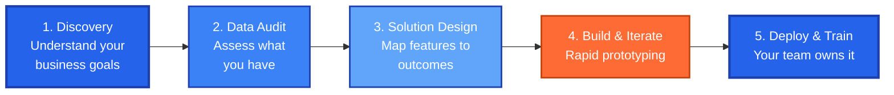

<!-- 
  MO QANASS | SMB-Focused Business Card
  Color Palette: Primary #2563EB (Blue), Accent #FF6B35 (Orange)
  Audience: Small & Medium Businesses needing geospatial solutions
  Tone: Direct, efficiency-focused, no fluff
-->

<!-- SECTION 1: HERO - Clear Value Proposition -->

 

---

### 📍 SECTION 1: WHAT I SOLVE FOR BUSINESSES

| Business Challenge | My Solution | Outcome |
|-------------------|-------------|---------|
| ❌ Can't visualize customer locations | ✅ Custom interactive maps | See patterns instantly |
| ❌ Data scattered across spreadsheets | ✅ Unified geospatial dashboards | One source of truth |
| ❌ No insight into territorial coverage | ✅ Heat maps & density analysis | Identify opportunities |
| ❌ Static reports that nobody reads | ✅ Interactive 3D visualizations | Engage stakeholders |

**Bottom line:** I turn your location data into actionable business intelligence—fast.

---

### 📦 SECTION 2: PRODUCTS & SERVICES

<table>
<tr>
<td width="33%" align="center">

### 🗺️ Custom WebGIS
Interactive maps tailored to your business needs. Track assets, customers, or operations in real-time.

**[View Case Study →](#)**
*(Screenshot: Dashboard with layered business data)*

</td>
<td width="33%" align="center">

### 📊 Geospatial Analytics
Transform raw coordinates into insights. Heat maps, clustering, proximity analysis.

**[See Sample Report →](#)**
*(Image: Before/after analytics comparison)*

</td>
<td width="33%" align="center">

### 🏢 Location Intelligence
Site selection, territory planning, market analysis powered by spatial data.

**[Explore Tools →](#)**
*(Diagram: Decision framework visualization)*

</td>
</tr>
</table>

---

### ⚙️ SECTION 3: HOW I WORK (PROCESS)

**Timeline:** Most SMB projects delivered in 2-4 weeks  
**Engagement:** Fixed-scope or retainer—your choice

---

### 🛠️ SECTION 4: TOOLS & TECHNOLOGIES

**Frontend Visualization:**

**Backend & Data:**

**Deployment & Integration:**

*(Note: I use the right tool for YOUR stack—not just what I prefer)*

---

### 📈 SECTION 5: TRACTION & METRICS

<table>
<tr>
<td width="25%" align="center">

### Projects Delivered
# **15+**
*SMB clients served*

*(Geographic distribution of clients)*

</td>
<td width="25%" align="center">

### Avg. Delivery Time
# **2-4 weeks**
*From brief to deployment*

*(Sample project Gantt chart)*

</td>
<td width="25%" align="center">

### Data Points Processed
# **Millions**
*Coordinates analyzed*

*(Example: Customer density heatmap)*

</td>
<td width="25%" align="center">

### Client Retention
# **80%+**
*Return for Phase 2+*

*(Repeat engagement chart)*

</td>
</tr>
</table>

**Recent Work Samples:**

| Project Type | Business Impact | Visual |
|-------------|-----------------|--------|
| Retail Chain Site Selection | Identified 3 high-potential locations | *[Map screenshot]* |
| Logistics Route Optimization | 18% reduction in fuel costs | *[Before/after routes]* |
| Real Estate Portfolio Dashboard | Saved 10hrs/week reporting time | *[Dashboard preview]* |

---

## 🤝 SECTION 6: WHO I WORK WITH

**Ideal Clients:**
- ✅ SMBs with location-dependent operations (retail, logistics, real estate)
- ✅ Regional businesses expanding to new territories
- ✅ Companies sitting on unused geospatial data
- ✅ Teams drowning in spreadsheets with address fields

**Not a Fit:**
- ❌ Enterprises requiring 6-month procurement cycles
- ❌ Projects without clear business outcomes
- ❌ "Just need a map" without strategy

---

## 📞 SECTION 7: CALL TO ACTION

### Ready to Turn Your Location Data Into Competitive Advantage?

**Next Steps:**

1. **Book a 20-min discovery call** → [Calendar Link]
2. **Share your data challenge** → I'll assess feasibility
3. **Get a fixed-scope proposal** → No vague estimates

**Contact:**

---

### 📋 Quick Reference

| Service | Starting At | Timeline |
|---------|------------|----------|
| Geospatial Audit | $X,XXX | 1 week |
| Custom WebGIS Dashboard | $X,XXX+ | 2-4 weeks |
| Location Analytics Report | $X,XXX | 1-2 weeks |
| Ongoing Support | Retainer | Flexible |

*Exact pricing after discovery call—every business is different.*

---

---

**Built for efficiency. Focused on outcomes.**  
© 2025 Mo Qanass | SMB Geospatial Solutions

