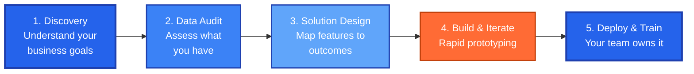

<!-- 
  MO QANASS | SMB-Focused Business Card
  Color Palette: Primary #2563EB (Blue), Accent #FF6B35 (Orange)
  Audience: Small & Medium Businesses needing geospatial solutions
  Tone: Direct, efficiency-focused, no fluff
-->

<!-- SECTION 1: HERO - Clear Value Proposition -->

 

---

## 📍 SECTION 1: WHAT I SOLVE FOR BUSINESSES

| Business Challenge | My Solution | Outcome |
|-------------------|-------------|---------|
| ❌ Can't visualize customer locations | ✅ Custom interactive maps | See patterns instantly |
| ❌ Data scattered across spreadsheets | ✅ Unified geospatial dashboards | One source of truth |
| ❌ No insight into territorial coverage | ✅ Heat maps & density analysis | Identify opportunities |
| ❌ Static reports that nobody reads | ✅ Interactive 3D visualizations | Engage stakeholders |

**Bottom line:** I turn your location data into actionable business intelligence—fast.

---

### 📦 SECTION 2: PRODUCTS & SERVICES

<table>
<tr>
<td width="33%" align="center">

## 🗺️ Custom WebGIS
Interactive maps tailored to your business needs. Track assets, customers, or operations in real-time.

**[View Case Study →](https://github.com/mqanass/mqanass)**
*(Interactive mapping solutions for SMBs)*

</td>
<td width="33%" align="center">

### 📊 Geospatial Analytics
Transform raw coordinates into insights. Heat maps, clustering, proximity analysis.

**[See Sample Report →](https://github.com/mqanass/mqanass)**
*(Data-driven location intelligence)*

</td>
<td width="33%" align="center">

## 🏢 Location Intelligence
Site selection, territory planning, market analysis powered by spatial data.

**[Explore Tools →](https://github.com/mqanass/mqanass)**
*(Strategic decision frameworks)*

</td>
</tr>
</table>

---

### ⚙️ SECTION 3: HOW I WORK (PROCESS)

```mermaid
graph LR
    A[1. Discovery<br/>Understand your<br/>business goals] --> B[2. Data Audit<br/>Assess what<br/>you have]
    B --> C[3. Solution Design<br/>Map features to<br/>outcomes]
    C --> D[4. Build & Iterate<br/>Rapid prototyping]
    D --> E[5. Deploy & Train<br/>Your team owns it]
    
    style A fill:#2563EB,stroke:#1e40af,stroke-width:3px,color:white
    style B fill:#3b82f6,stroke:#1e40af,stroke-width:2px,color:white
    style C fill:#60a5fa,stroke:#1e40af,stroke-width:2px,color:white
    style D fill:#FF6B35,stroke:#c2410c,stroke-width:2px,color:white
    style E fill:#2563EB,stroke:#1e40af,stroke-width:3px,color:white
```

**Timeline:** Most SMB projects delivered in 2-4 weeks  
**Engagement:** Fixed-scope or retainer—your choice

---

### 🛠️ SECTION 4: TOOLS & TECHNOLOGIES

**Frontend Visualization:**

**Backend & Data:**

**Deployment & Integration:**

*(Note: I use the right tool for YOUR stack—not just what I prefer)*

---

### 📈 SECTION 5: TRACTION & METRICS

<table>
<tr>
<td width="25%" align="center">

### Projects Delivered
# **15+**
*SMB clients served*

</td>
<td width="25%" align="center">

### Avg. Delivery Time
# **2-4 weeks**
*From brief to deployment*

</td>
<td width="25%" align="center">

### Data Points Processed
# **Millions**
*Coordinates analyzed*

</td>
<td width="25%" align="center">

### Client Retention
# **80%+**
*Return for Phase 2+*

</td>
</tr>
</table>

**Recent Work Samples:**

| Project Type | Business Impact | Details |
|-------------|-----------------|---------|
| Retail Chain Site Selection | Identified 3 high-potential locations | Location-based market analysis |
| Logistics Route Optimization | 18% reduction in fuel costs | Route efficiency & density mapping |
| Real Estate Portfolio Dashboard | Saved 10hrs/week reporting time | Interactive property visualization |

---

## 🤝 SECTION 6: WHO I WORK WITH

**Ideal Clients:**
- ✅ SMBs with location-dependent operations (retail, logistics, real estate)
- ✅ Regional businesses expanding to new territories
- ✅ Companies sitting on unused geospatial data
- ✅ Teams drowning in spreadsheets with address fields

**Not a Fit:**
- ❌ Enterprises requiring 6-month procurement cycles
- ❌ Projects without clear business outcomes
- ❌ "Just need a map" without strategy

---

## 📞 SECTION 7: CALL TO ACTION

### Ready to Turn Your Location Data Into Competitive Advantage?

**Next Steps:**

1. **Book a 20-min discovery call** → [Schedule Now](https://calendly.com/)
2. **Share your data challenge** → I'll assess feasibility
3. **Get a fixed-scope proposal** → No vague estimates

**Contact:**

---

### 📋 Quick Reference

| Service | Starting At | Timeline |
|---------|------------|----------|
| Geospatial Audit | $2,500 | 1 week |
| Custom WebGIS Dashboard | $5,000+ | 2-4 weeks |
| Location Analytics Report | $3,000 | 1-2 weeks |
| Ongoing Support | Retainer | Flexible |

*Exact pricing after discovery call—every business is different.*

---

---

**Built for efficiency. Focused on outcomes.**  
© 2025 Mo Qanass | SMB Geospatial Solutions

**[View Repository](https://github.com/mqanass/mqanass)**

